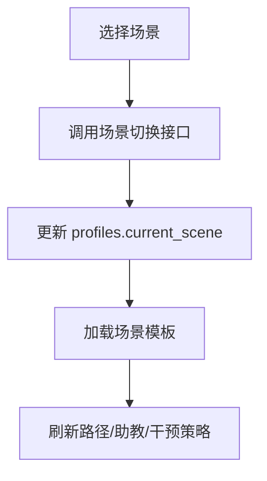

# 模块 PRD：跨场景智适应

## 1. 背景与目标
跨场景模块保证学生在不同学习情境（课堂、自习、考前）之间切换时，策略与数据连续，不需要重建学习上下文。

P0 目标：`手动切换 + 策略模板`。

## 2. 范围定义
### 2.1 In Scope
1. 用户手动切换学习场景。
2. 场景模板驱动策略切换（路径节奏、干预强度、答疑风格）。
3. 场景切换后的状态同步与连续展示。

### 2.2 Out of Scope
1. 高置信全自动场景识别（P2）。
2. 多设备跨端复杂协同。

## 3. 用户流程

## 4. 功能需求
### 4.1 用户故事
1. 作为学生，我希望从“自习”切到“考前复习”后，系统自动提高薄弱点优先级。
2. 作为学生，我希望场景切换后历史学习状态不丢失。

### 4.2 触发条件与系统行为
1. 触发：用户点击场景切换。
- 行为：更新用户当前场景并返回场景策略。
2. 触发：进入新场景首页。
- 行为：按模板渲染路径建议、助教提示风格、干预阈值。

### 4.3 异常路径
1. 场景值非法：拒绝切换并返回当前可选列表。
2. 模板加载失败：回退 `self-study` 默认模板。

## 5. 接口与数据
### 5.1 新增 REST API
#### POST `/api/v1/scenes/switch`
请求字段：
- `scene: SceneType`

响应字段：
- `currentScene: SceneType`
- `strategy: {
  pathMode: "balanced" | "weakness-first" | "exam-sprint",
  interventionLevel: "low" | "medium" | "high",
  tutorMode: "hint_first" | "mixed"
}`
- `effectiveAt: string`

#### GET `/api/v1/scenes/current`
响应字段：
- `currentScene: SceneType`
- `strategy: object`

### 5.2 数据表映射
- `profiles.current_scene`
- `study_logs.scene`

### 5.3 错误码
- `400` 不支持的场景值
- `401` 鉴权失败
- `500` 场景策略加载失败

## 6. 非功能要求
1. 场景切换应在同一会话内即时生效。
2. 切换后保持原有路径和会话 ID，不重建用户身份状态。
3. 策略模板必须可配置，避免硬编码散落在前端。

## 7. 验收标准
1. 从 `self-study` 切换到 `exam-prep` 后，页面展示策略变化。
2. 切换后仍可继续当前学习路径，不丢失进度。
3. 非法场景输入会被拦截并给出可读错误。
4. 模板加载失败会自动回退默认模板并可见提示。

## 8. 分期路线
- P0：手动切换 + 模板策略。
- P1：半自动识别（基于用户行为与时间段）。
- P2：高置信自动场景编排与持续优化。

## 9. 代码落地映射
- Web：新增 `web/components/scene-switcher.tsx`、`web/lib/context/scene-context.tsx`
- Server：新增 `server/internal/handler/scene.go`、`server/internal/service/scene_service.go`
- AI：在对话与干预请求中读取 `scene` 字段调整策略
