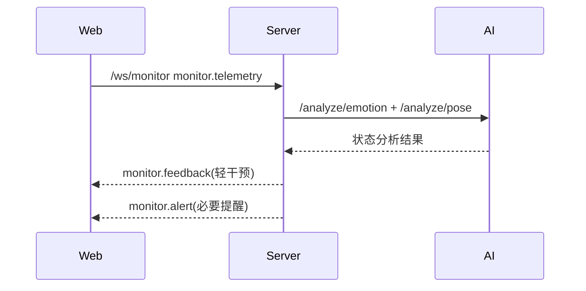

# 模块 PRD：情绪智能干预系统

## 1. 背景与目标
情绪干预模块用于在不打断学习主任务的前提下，识别学生学习状态并提供轻量、可执行建议。

P0 目标：`轻干预提醒`（不强制中断流程）。

## 2. 范围定义
### 2.1 In Scope
1. 实时状态采集（面部、语音、行为信号抽象值）。
2. 情绪/疲劳/注意力综合判断。
3. 轻干预动作推荐（鼓励、难度微调、休息建议）。
4. 干预记录写入学习日志。

### 2.2 Out of Scope
1. 强制中断式干预流程。
2. 医疗或临床性质心理诊断。

## 3. 用户流程


## 4. 功能需求
### 4.1 用户故事
1. 作为学生，我希望在分心或焦虑时收到简短建议，而不是被强制打断。
2. 作为学生，我希望干预建议和当前学习任务相关，而不是泛化提示。

### 4.2 触发条件与系统行为
1. 触发：`focusScore` 连续下降。
- 行为：推送 `adjust_difficulty` 或 `encourage`。
2. 触发：`fatigueLevel` 超阈值。
- 行为：推送 `suggest_break`，并记录健康提醒。
3. 触发：姿态异常持续。
- 行为：推送 `posture_reminder`。

### 4.3 异常路径
1. 视频/音频不可用：自动降级为行为信号分析。
2. AI 超时：返回静态策略模板并标记 `fallbackMode=ai_timeout`。
3. WS 断连：前端重连并回补最近状态窗口。

## 5. 接口与数据
### 5.1 WebSocket `/ws/monitor`
#### 上行：`monitor.telemetry`
```json
{
  "event": "monitor.telemetry",
  "timestamp": "2026-03-02T12:00:00Z",
  "traceId": "uuid",
  "sessionId": "study-session-id",
  "payload": {
    "scene": "self-study",
    "focusScore": 0.62,
    "fatigueLevel": 0.43,
    "postureStatus": "slouching",
    "emotionHints": ["confused"],
    "audioFeatures": {"energy": 0.31},
    "videoFeatures": {"faceDetected": true}
  }
}
```

#### 下行：`monitor.feedback`
```json
{
  "event": "monitor.feedback",
  "timestamp": "2026-03-02T12:00:02Z",
  "traceId": "uuid",
  "sessionId": "study-session-id",
  "payload": {
    "action": "suggest_break",
    "message": "你已经连续学习较久，建议休息3-5分钟再继续。",
    "ttlSec": 20
  }
}
```

#### 错误：`monitor.error`
- `code`: `INVALID_PAYLOAD` | `UNAUTHORIZED` | `UPSTREAM_TIMEOUT`
- `message`: 可读错误说明

### 5.2 新增 REST API
#### POST `/api/v1/interventions/evaluate`
用途：在非 WS 模式下批量评估干预策略。

请求字段：
- `scene: SceneType`
- `focusScore: number`
- `fatigueLevel: number`
- `postureStatus: PostureStatus`
- `emotion: EmotionType`

响应字段：
- `action: InterventionAction`
- `message: string`
- `fallbackMode?: FallbackMode`

### 5.3 Server -> AI 内部 API（规划）
1. `POST /analyze/emotion`
- 请求：`{ image, audio, scene }`
- 响应：`{ emotion, confidence, focusScore, fatigueLevel }`
2. `POST /analyze/pose`
- 请求：`{ image }`
- 响应：`{ postureStatus, confidence }`

### 5.4 数据表映射
- `study_logs`：持续写入状态片段。
- `health_alerts`：记录提醒事件（`fatigue/posture/break_needed/stress`）。

### 5.5 错误码
- `400` 参数错误
- `401` 鉴权失败
- `429` 采样过频或流量受限
- `502` 上游 AI 失败

## 6. 非功能要求
1. 干预消息必须“短、可执行、与当前任务相关”。
2. 10 秒内同类提醒去重，避免提示轰炸。
3. 日志默认保存抽象特征，不保存原始音视频。

## 7. 验收标准
1. 连续收到状态上报后，系统可返回轻干预建议。
2. AI 不可用时，前端仍可收到静态回退建议。
3. 干预不会自动跳转页面或阻断作答流程。
4. `health_alerts` 能查询到对应提醒记录。

## 8. 分期路线
- P0：轻干预策略 + 基础状态识别。
- P1：更细粒度情绪状态识别与个体化阈值。
- P2：长期行为模式建模与策略自适应。

## 9. 代码落地映射
- Web：新增 `web/app/(dashboard)/study/page.tsx`、`web/components/monitor/*`
- Server：新增 `server/internal/handler/intervention.go`、`server/internal/service/intervention_service.go`
- AI：新增 `ai/app/routers/emotion.py`、`ai/app/chains/emotion_chain.py`、`ai/app/chains/pose_chain.py`
