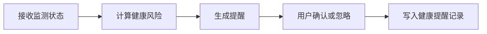

# 模块 PRD：学习健康管理

## 1. 背景与目标
健康管理模块保障学生在长时学习中的身体与注意力状态，强调“提醒式干预 + 可追踪记录”。

P0 目标：`疲劳 + 坐姿 + 休息建议`。

## 2. 范围定义
### 2.1 In Scope
1. 专注度、疲劳度、姿态状态追踪。
2. 健康提醒生成与确认。
3. 学习会话内健康趋势展示。

### 2.2 Out of Scope
1. 医疗诊断建议。
2. 与外部可穿戴设备深度集成。

## 3. 用户流程

## 4. 功能需求
### 4.1 用户故事
1. 作为学生，我希望在疲劳明显时收到简短可执行的休息建议。
2. 作为学生，我希望看到自己的近期健康提醒历史，避免重复问题。

### 4.2 触发条件与系统行为
1. 触发：`fatigueLevel` 持续偏高。
- 行为：生成 `break_needed` 或 `fatigue` 提醒。
2. 触发：`postureStatus=slouching/too_close` 持续出现。
- 行为：生成 `posture` 提醒。
3. 触发：用户点击“已处理”。
- 行为：更新提醒状态 `acknowledged=true`。

### 4.3 异常路径
1. 状态数据中断：使用最近窗口状态进行短期估计。
2. 提醒写库失败：本地缓存后重试。

## 5. 接口与数据
### 5.1 新增 REST API
#### GET `/api/v1/health/alerts?acknowledged=false`
响应字段：
- `items: [{ id, alertType, message, acknowledged, createdAt }]`

#### POST `/api/v1/health/alerts/:id/ack`
响应字段：
- `id: number`
- `acknowledged: true`
- `updatedAt: string`

#### GET `/api/v1/health/summary?range=today`
响应字段：
- `focusTrend: [{ ts, value }]`
- `fatigueTrend: [{ ts, value }]`
- `postureDistribution: [{ status, ratio }]`

### 5.2 与监测通道联动
- 读取 `/ws/monitor` 的上报数据生成提醒，不新增采集协议。

### 5.3 数据表映射
- `study_logs`：专注、疲劳、姿态时间序列。
- `health_alerts`：提醒事件与确认状态。

### 5.4 错误码
- `400` 参数错误
- `401` 鉴权失败
- `404` 提醒不存在
- `500` 状态写入失败

## 6. 非功能要求
1. 同类提醒在短窗口内应合并，减少干扰。
2. 健康建议文案必须避免医疗结论化表达。
3. 历史提醒仅对本人可见。

## 7. 验收标准
1. 疲劳/姿态异常可触发对应提醒。
2. 用户可确认提醒，状态变化可查询。
3. 无摄像头或音频时仍可提供基础提醒（降级）。
4. 健康提醒不会强制跳出学习流程。

## 8. 分期路线
- P0：疲劳、姿态、休息提醒与确认。
- P1：学习节律建议（基于历史会话）。
- P2：长期健康趋势分析与个体方案。

## 9. 代码落地映射
- Web：新增 `web/components/health/*`、`web/app/(dashboard)/dashboard/page.tsx` 健康卡片扩展
- Server：新增 `server/internal/handler/health.go`、`server/internal/service/health_service.go`
- AI：复用情绪/姿态分析结果，不新增独立模型入口
