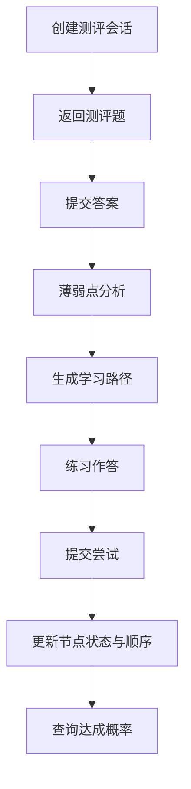

# 模块 PRD：智能个性化学习路径规划

## 1. 背景与目标
学习路径规划模块负责把学生的目标与当前能力映射为可执行学习序列，并在练习与作业反馈后动态调整。

P0 目标：`诊断 + 动态路径 + 作业批改闭环`。

## 2. 范围定义
### 2.1 In Scope
1. 冷启动测评会话创建与提交。
2. 薄弱点提炼与路径生成。
3. 当前路径可视化（节点、边、状态）。
4. 练习尝试提交后路径实时调整。
5. 路径达成概率预测。

### 2.2 Out of Scope
1. 跨学科混合路径优化（P2）。
2. 班级维度路径对比与分组。

## 3. 用户流程

## 4. 功能需求
### 4.1 用户故事
1. 作为学生，我希望系统根据我的目标知识点生成优先级明确的学习顺序。
2. 作为学生，我希望每次练习后路径能更新，而不是固定不变。
3. 作为学生，我希望知道整体与分知识点的达成概率，便于安排复习。

### 4.2 触发条件与系统行为
1. 触发：提交冷启动答案。
- 系统行为：计算薄弱点，输出路径节点状态与边关系。
2. 触发：提交路径内练习尝试。
- 系统行为：更新掌握度、当前节点、调整事件列表。
3. 触发：请求预测。
- 系统行为：聚合节点基础概率，调用 AI 校准并返回解释。

### 4.3 异常路径
1. `sessionId/pathId` 非法：返回 `400`。
2. 题目或路径不存在：返回 `404`。
3. AI 预测失败：返回回退解释并标记降级模式。

## 5. 接口与数据
### 5.1 API 合约（已有）
#### POST `/api/v1/assessment/cold-start/sessions`
请求字段：
- `subject: string`（必填）
- `goalKnowledgeIds: number[]`（必填）
- `targetDate: string(YYYY-MM-DD)`（必填）

响应字段：
- `sessionId: number`
- `subject: string`
- `targetDate: string`
- `questions: [{ id, knowledgeId, difficulty, question, options[] }]`

#### POST `/api/v1/assessment/cold-start/sessions/:sessionId/submit`
请求字段：
- `answers: [{ questionId: number, answer: string, durationSec: number }]`

响应字段：
- `weakPoints: [{ knowledgeId, title, weakScore, reason }]`
- `learningPath: LearningPathDTO`

#### GET `/api/v1/learning-paths/current?subject=<subject>`
响应字段（`LearningPathDTO`）：
- `pathId: number`
- `subject: string`
- `targetDate: string`
- `currentIndex: number`
- `nodes: [{ id, title, subject, status, mastery, prerequisiteIds[], isCurrent, isSkipped, predictedImproveProb }]`
- `edges: [{ from, to }]`
- `overallImproveProb: number`
- `adjustmentEvents?: [{ eventType, payload, createdAt }]`

#### POST `/api/v1/learning-paths/:pathId/attempts`
请求字段：
- `questionId: number`
- `knowledgeId: number`
- `answer: string`
- `durationSec: number`
- `source: string`（例如 `practice`/`homework`）

响应字段：更新后的 `LearningPathDTO`

#### GET `/api/v1/learning-paths/:pathId/prediction`
响应字段：
- `overallProbability: number`
- `nodeProbabilities: [{ knowledgeId, title, probability }]`
- `rationale: string`

### 5.2 依赖 AI 内部接口（已有）
1. `POST /assessment/predict-outcome`
- 请求：`{ subject, overallBaseProb, nodes[{knowledgeId,title,baseProbability}] }`
- 响应：`{ calibrationFactor, rationale }`

### 5.3 关键数据表映射
- `knowledge_points`、`knowledge_dependencies`、`knowledge_mastery`
- `learning_paths`、`assignments`、`questions`

### 5.4 错误码
- `400` 参数错误/业务规则不满足
- `401` 鉴权失败
- `404` 路径不存在
- `502` AI 依赖失败

## 6. 非功能要求
1. 路径更新操作必须幂等，避免重复提交引起状态错乱。
2. 预测失败时允许返回最近一次有效概率结果。
3. 鉴权统一走本地 JWKS 校验。

## 7. 验收标准
1. 测评提交后可返回至少一个薄弱点与完整路径结构。
2. 连续两次练习提交后，节点状态或排序可见变化。
3. 预测接口返回整体概率与节点概率，并有可读解释。
4. 非法 `pathId` 请求会收到可读错误。

## 8. 分期路线
- P0：测评、路径、动态调整、预测闭环。
- P1：依赖关系优化（前置链冲突处理、权重更新）。
- P2：跨学科个性化策略与联合路径。

## 9. 代码落地映射
- Web：`web/app/(dashboard)/assessment/page.tsx`、`web/app/(dashboard)/learning-path/page.tsx`、`web/components/learning-path/*`
- Server：`server/internal/handler/assessment.go`、`server/internal/handler/learning_path.go`、`server/internal/service/learning_service.go`
- AI：`ai/app/routers/assessment.py`、`ai/app/chains/prediction_chain.py`、`ai/app/chains/grading_chain.py`
