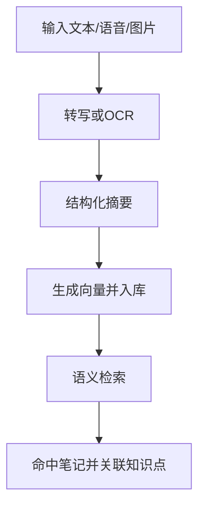

# 模块 PRD：智能笔记助手

## 1. 背景与目标
智能笔记模块负责把文本、语音、图像输入统一沉淀为可检索、可关联知识点的学习资产。

P0 目标：`采集 + 结构化 + 语义检索`。

## 2. 范围定义
### 2.1 In Scope
1. 文本、语音、OCR 三类输入。
2. 自动提纲、关键点提炼。
3. 语义检索与知识点关联。
4. 笔记与学习路径联动跳转。

### 2.2 Out of Scope
1. 大规模协同编辑。
2. 复杂富文本编辑器插件系统。

## 3. 用户流程

## 4. 功能需求
### 4.1 用户故事
1. 作为学生，我希望语音和图片内容自动变成可搜索的文字笔记。
2. 作为学生，我希望笔记能自动关联到当前学习路径知识点。

### 4.2 触发条件与系统行为
1. 触发：上传手写截图。
- 行为：调用 OCR，抽取结构化内容并创建笔记。
2. 触发：上传语音片段。
- 行为：语音转写后进行提纲生成。
3. 触发：输入检索问题。
- 行为：生成查询向量并返回高相关笔记。

### 4.3 异常路径
1. OCR 失败：保留原图并提示手动补录。
2. 转写失败：允许重试并返回错误原因。
3. 检索无结果：回退关键词检索并提示补充上下文。

## 5. 接口与数据
### 5.1 新增 REST API
#### POST `/api/v1/notes`
请求字段：
- `title: string`
- `content: string`
- `sourceType: NoteSourceType`
- `subject: string`
- `relatedKnowledgeIds?: number[]`

响应字段：
- `id: number`
- `title: string`
- `content: string`
- `sourceType: string`
- `createdAt: string`
- `updatedAt: string`

#### GET `/api/v1/notes?subject=math&query=...`
响应字段：
- `items: [{ id, title, content, sourceType, relevanceScore, relatedKnowledgeIds[], updatedAt }]`

#### POST `/api/v1/notes/transcribe`
请求字段：
- `audio: string(base64)`
- `language?: string`

响应字段：
- `text: string`
- `segments: [{ startSec, endSec, text }]`

#### POST `/api/v1/notes/ocr`
请求字段：
- `image: string(base64)`
- `task: "handwriting" | "document" | "formula"`

响应字段：
- `text: string`
- `structured: object`

### 5.2 Server -> AI 内部 API（规划 + 复用）
1. `POST /vision/ocr`（已有）
2. `POST /speech/transcribe`（规划）
3. `POST /embed`（规划）
4. `POST /search`（规划）

### 5.3 数据表映射
- `notes`（正文 + embedding）
- `note_knowledge_links`（知识点关联）
- `knowledge_points`（关联目标）

### 5.4 错误码
- `400` 参数错误
- `401` 鉴权失败
- `413` 上传内容过大
- `502` AI 处理失败

## 6. 非功能要求
1. 所有笔记输入在保存前执行基本清洗，防止脚本注入。
2. 向量检索失败时系统应自动回退关键词检索。
3. 语音与图片原始数据可配置为短期缓存后删除。

## 7. 验收标准
1. 语音和图片都可转成可编辑文本笔记。
2. 检索结果包含相关度并可查看关联知识点。
3. OCR/转写失败时前端展示可重试路径，不中断主流程。
4. 新增笔记可在当前学习会话中被立即检索到。

## 8. 分期路线
- P0：采集、结构化、检索闭环。
- P1：自动知识链接增强与摘要质量提升。
- P2：跨会话学习档案自动生成。

## 9. 代码落地映射
- Web：新增 `web/app/(dashboard)/notes/page.tsx`、`web/components/notes/*`
- Server：新增 `server/internal/handler/notes.go`、`server/internal/service/notes_service.go`
- AI：扩展 `ai/app/routers/vision.py`，新增 `ai/app/routers/speech.py`、`ai/app/routers/search.py`
