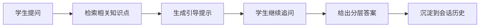

# 模块 PRD：智能虚拟助教

## 1. 背景与目标
虚拟助教模块提供多轮问答，采用“分层提示式”策略：先引导思路，再在必要时给出结论，避免直接给答案导致被动学习。

P0 目标：`分层提示式答疑（先引导后结论）`。

## 2. 范围定义
### 2.1 In Scope
1. 助教会话创建、消息持久化。
2. WebSocket 流式响应。
3. 关联知识点推荐。
4. 与当前学习路径联动（按当前节点优先提示）。

### 2.2 Out of Scope
1. 角色扮演型长对话人格系统。
2. 教师批量分发问答任务。

## 3. 用户流程


## 4. 功能需求
### 4.1 用户故事
1. 作为学生，我希望助教先提示解题方向，再在我需要时给出关键步骤。
2. 作为学生，我希望答复能关联到具体知识点，便于回到路径学习。

### 4.2 触发条件与系统行为
1. 触发：用户首次提问。
- 行为：建立会话并返回第一层引导。
2. 触发：用户要求“直接答案”。
- 行为：给出结论并附简短解释与风险提示。
3. 触发：问题超出当前学科范围。
- 行为：返回范围说明并建议切换场景或学科。

### 4.3 异常路径
1. 检索无结果：返回通用解题框架模板。
2. 流式中断：客户端可重试最后一次消息。
3. 上游超时：回退静态答疑模板。

## 5. 接口与数据
### 5.1 新增 REST API
#### GET `/api/v1/assistant/sessions`
响应字段：
- `items: [{ id, title, createdAt, updatedAt }]`

#### POST `/api/v1/assistant/sessions`
请求字段：
- `title?: string`
- `scene: SceneType`

响应字段：
- `id: number`
- `title: string`
- `createdAt: string`

#### GET `/api/v1/assistant/sessions/:sessionId/messages`
响应字段：
- `items: [{ id, role, content, relatedKnowledgeIds[], createdAt }]`

### 5.2 WebSocket `/ws/assistant`
#### 上行：`assistant.user_message`
```json
{
  "event": "assistant.user_message",
  "timestamp": "2026-03-02T12:08:00Z",
  "traceId": "uuid",
  "sessionId": "chat-1",
  "payload": {
    "content": "这道二次函数题怎么下手？",
    "subject": "math",
    "pathId": 101,
    "currentKnowledgeId": 23
  }
}
```

#### 下行：`assistant.delta` / `assistant.done`
```json
{
  "event": "assistant.delta",
  "timestamp": "2026-03-02T12:08:01Z",
  "traceId": "uuid",
  "sessionId": "chat-1",
  "payload": {
    "stage": "hint",
    "content": "先判断抛物线开口方向，再找顶点坐标。",
    "relatedKnowledgeIds": [23, 24]
  }
}
```

### 5.3 Server -> AI 内部 API（规划）
#### POST `/chat/completions`
请求字段：
- `messages: [{ role, content }]`
- `subject: string`
- `scene: SceneType`
- `retrievalContext: [{ knowledgeId, title, content }]`
- `responseMode: "hint_first" | "direct"`

响应字段（SSE 或流式分片）：
- `delta: string`
- `stage: "hint" | "explain" | "answer"`
- `relatedKnowledgeIds: number[]`

### 5.4 数据表映射
- `chat_sessions`
- `chat_messages`
- `knowledge_points`（检索与关联）

### 5.5 错误码
- `400` 请求无效
- `401` 鉴权失败
- `404` 会话不存在
- `502` 对话模型调用失败

## 6. 非功能要求
1. 默认答复风格保持“提示优先”，降低直接给答案比例。
2. 同一会话内上下文窗口必须可控，避免无限增长。
3. 所有会话请求都走 JWT 本地校验。

## 7. 验收标准
1. 同一问题可返回“提示 -> 解释 -> 结论”的分层响应。
2. 响应中包含关联知识点 ID，并可回链到学习路径。
3. 网络中断后可继续会话，不丢失历史消息。
4. AI 失败时有静态回退文案，且前端可识别降级状态。

## 8. 分期路线
- P0：分层提示式问答 + 会话持久化。
- P1：增强知识图谱检索与引用质量。
- P2：多策略教学人格与长期学习偏好记忆。

## 9. 代码落地映射
- Web：新增 `web/app/(dashboard)/assistant/page.tsx`、`web/components/assistant/*`
- Server：新增 `server/internal/handler/assistant.go`、`server/internal/service/assistant_service.go`
- AI：新增 `ai/app/routers/chat.py`、`ai/app/chains/chat_rag_chain.py`
