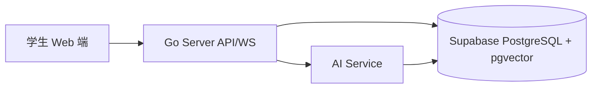
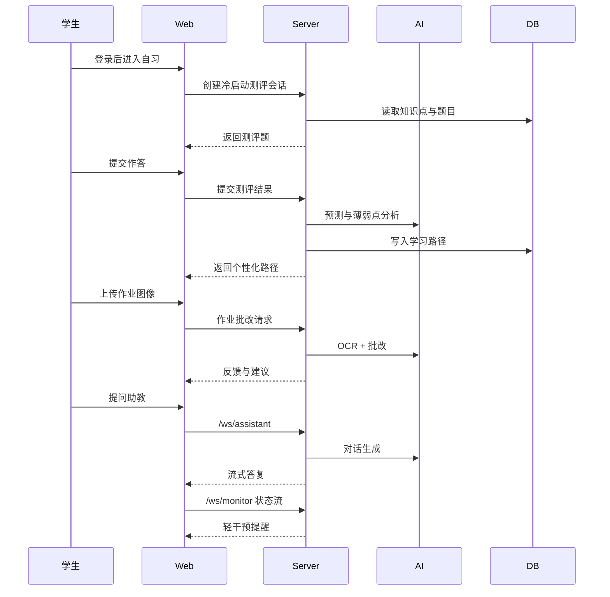

# Prism 总体产品需求文档（PRD）

## 1. 文档信息
- 文档名称：Prism 首版总体 PRD
- 目标读者：产品、前端、后端、AI 工程、测试、答辩成员
- 文档范围：高中学生（数学+物理）自习场景的首版可演示版本
- 版本：v1.0（首版）

## 2. 背景与目标
### 2.1 问题定义
当前高中生在自习场景中常见三个问题：
1. 学习路径缺少个性化，练习顺序和难度不稳定。
2. 遇到问题时求助成本高，答疑反馈慢。
3. 长时间学习中的情绪、疲劳、坐姿变化缺少及时干预。

### 2.2 产品目标
Prism 通过六大模块形成单设备 Web 端学习闭环：
1. 诊断与路径规划。
2. 作业/练习反馈与动态调整。
3. 虚拟助教分层答疑。
4. 多模态笔记沉淀与检索。
5. 学习健康轻干预。
6. 跨场景策略切换与状态连续。

### 2.3 非目标（首版不覆盖）
1. 专用硬件设备定制（眼镜、手环等）。
2. 教师管理后台与班级运营能力。
3. 商业计费与结算系统。

## 3. 用户与场景
### 3.1 目标用户
- 主用户：高中学生（优先数学、物理）。
- 使用环境：课后自习、晚自习、周末在家学习。

### 3.2 典型场景边界
- 主场景：`self-study`。
- 兼容场景：`classroom`、`exam-prep`（首版通过模板策略支持，不依赖复杂自动识别）。

## 4. 范围定义
### 4.1 In Scope（P0 首版演示）
1. 冷启动评估 + 学习路径生成 + 动态路径调整。
2. 作业图片上传、OCR、自动批改、薄弱点提炼。
3. 助教问答（分层提示），关联知识点推荐。
4. 语音/OCR 笔记采集、结构化摘要、语义检索。
5. 专注/疲劳/坐姿监测与轻干预提醒。
6. 手动场景切换与策略模板生效。
7. 演示级故障降级（AI 超时回退）。

### 4.2 Out of Scope（P0）
1. 班级维度教学运营和教师工作台。
2. 复杂商业化能力（套餐、订阅、支付）。
3. 高风险心理临床评估结论。

## 5. 系统架构与职责
- Web（Next.js 16）：学习交互、状态展示、音视频采集、笔记界面。
- Server（Go/Gin）：业务编排、鉴权、路径与会话管理、WS 网关。
- AI（FastAPI/LangChain）：OCR、批改、预测、对话与检索能力。
- 数据层（Supabase PostgreSQL + pgvector）：学习状态、知识图谱、笔记、监测日志。



## 6. 全局术语与公共类型
### 6.1 枚举
- `SceneType`：`classroom` | `self-study` | `exam-prep`
- `EmotionType`：`focused` | `confused` | `anxious` | `frustrated` | `tired`
- `PostureStatus`：`good` | `slouching` | `too_close`
- `InterventionAction`：`adjust_difficulty` | `encourage` | `suggest_break` | `posture_reminder`
- `NoteSourceType`：`manual` | `voice` | `ocr` | `auto-generated`
- `HealthAlertType`：`fatigue` | `posture` | `break_needed` | `stress`
- `FallbackMode`：`ai_timeout` | `ai_unavailable` | `network_degraded` | `manual_override`

### 6.2 公共消息外壳（WS/SSE）
```json
{
  "event": "string",
  "timestamp": "ISO8601",
  "traceId": "string",
  "sessionId": "string",
  "payload": {}
}
```

## 7. 核心用户流程（端到端）


## 8. 公共接口规范
### 8.1 鉴权约束（受保护接口统一）
1. Header：`Authorization: Bearer <Supabase_JWT>`。
2. Server 使用 Supabase JWKS 本地验签。
3. 必须校验 `sub`、`exp`、`iss`、`aud`。
4. `aud` 必须包含 `authenticated`。
5. JWT 失败返回 `401`，统一错误体：`{"error":"..."}`。

### 8.2 Server 对外 API（`/api/v1`）
| 方法 | 路径 | 状态 | 说明 |
|---|---|---|---|
| POST | `/assessment/cold-start/sessions` | 已有 | 创建冷启动测评会话 |
| POST | `/assessment/cold-start/sessions/:sessionId/submit` | 已有 | 提交测评并生成路径 |
| POST | `/assessment/homework/grade` | 已有 | 作业图片 OCR + 批改 |
| GET | `/learning-paths/current` | 已有 | 获取当前学习路径 |
| POST | `/learning-paths/:pathId/attempts` | 已有 | 提交路径练习尝试 |
| GET | `/learning-paths/:pathId/prediction` | 已有 | 获取路径达成概率 |
| GET | `/knowledge-points` | 已有 | 获取知识点列表 |
| GET | `/weaknesses` | 已有 | 获取薄弱点列表 |
| POST | `/interventions/evaluate` | 新增 | 根据监测状态返回干预建议 |
| GET | `/assistant/sessions` | 新增 | 助教会话列表 |
| POST | `/assistant/sessions` | 新增 | 创建助教会话 |
| GET | `/notes` | 新增 | 查询笔记与过滤 |
| POST | `/notes` | 新增 | 创建/更新笔记 |
| POST | `/scenes/switch` | 新增 | 手动切换学习场景 |
| GET | `/health/alerts` | 新增 | 查询健康提醒列表 |

### 8.3 WebSocket 通道
1. `/ws/monitor`
- 上行事件：`monitor.telemetry`
- 下行事件：`monitor.feedback`、`monitor.alert`
- 错误事件：`monitor.error`
2. `/ws/assistant`
- 上行事件：`assistant.user_message`
- 下行事件：`assistant.delta`、`assistant.done`
- 错误事件：`assistant.error`

### 8.4 Server -> AI 内部 API
| 方法 | 路径 | 状态 | 说明 |
|---|---|---|---|
| POST | `/vision/ocr` | 已有 | OCR / 图像理解 |
| POST | `/assessment/grade-homework` | 已有 | 作业批改 |
| POST | `/assessment/predict-outcome` | 已有 | 达成概率校准 |
| POST | `/analyze/emotion` | 规划 | 情绪分析 |
| POST | `/analyze/pose` | 规划 | 姿态分析 |
| POST | `/chat/completions` | 规划 | RAG 对话（流式） |
| POST | `/speech/transcribe` | 规划 | 语音转写 |
| POST | `/embed` | 规划 | 生成向量 |
| POST | `/search` | 规划 | 语义检索 |

## 9. 数据与状态映射
- 用户档案：`profiles.current_scene` 用于场景模板生效。
- 路径规划：`knowledge_points`、`knowledge_dependencies`、`knowledge_mastery`、`learning_paths`。
- 测评反馈：`questions`、`assignments`。
- 监测与健康：`study_logs`、`health_alerts`。
- 助教会话：`chat_sessions`、`chat_messages`。
- 笔记系统：`notes`、`note_knowledge_links`。

## 10. 非功能要求
### 10.1 安全与隐私基线
1. 前端受保护路由必须经 `auth.getUser()` 权威校验。
2. 重定向参数 `redirectTo` 必须清洗为同源相对路径。
3. 日志默认不记录原始音视频和敏感文本。
4. 演示数据使用脱敏/模拟样本。

### 10.2 可用性与可靠性
1. 关键路径失败时必须可回退到预置策略。
2. WebSocket 断连自动重连（指数退避，最多 3 次）。
3. Server 调用 AI 失败返回可展示的可读错误信息。

### 10.3 降级策略
- AI 超时：返回静态建议模板并标记 `fallbackMode=ai_timeout`。
- AI 不可用：保留本地路径与历史笔记展示。
- 网络抖动：暂停流式响应，允许用户重试。

## 11. 验收标准（场景化）
1. 学生可在一次会话内完成“测评 -> 路径 -> 作业 -> 助教 -> 笔记 -> 健康提醒”。
2. 场景切换后，策略模板立即生效且不丢失会话上下文。
3. OCR 与语音输入的笔记可在语义检索中命中。
4. `/ws/monitor` 可持续接收状态并触发轻干预，不强中断学习流程。
5. AI 故障时演示流程不终止，界面能解释当前回退策略。
6. 未授权请求被拦截，鉴权失败响应符合约定。

## 12. 分期路线
### P0（首版可演示）
- 完成六模块最小闭环能力，重点保障演示稳定与可讲解性。

### P1（赛后 1-2 个月）
- 深化识别精度、知识图谱关联、半自动场景识别。

### P2（长期）
- 跨学科策略、自动场景编排、长期学习与健康画像。

## 13. 代码落地映射（当前仓库）
- Web：`web/app/(dashboard)/assessment/page.tsx`、`web/app/(dashboard)/learning-path/page.tsx`、`web/lib/api/client.ts`
- Server：`server/main.go`、`server/internal/handler/*.go`、`server/internal/service/*.go`
- AI：`ai/app/routers/assessment.py`、`ai/app/routers/vision.py`、`ai/app/chains/*.py`
