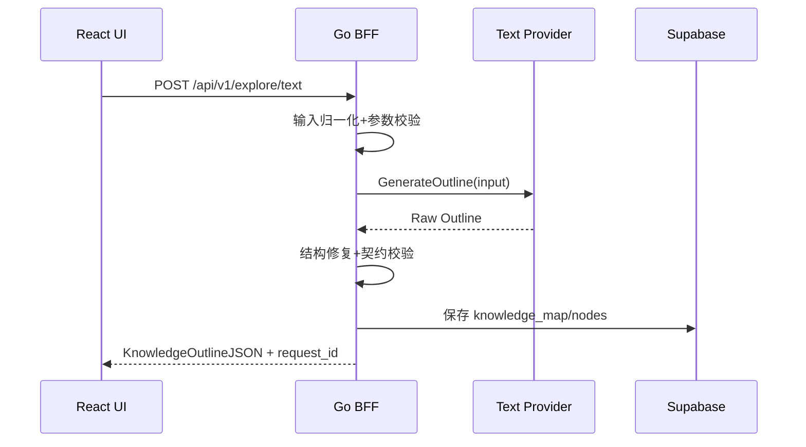
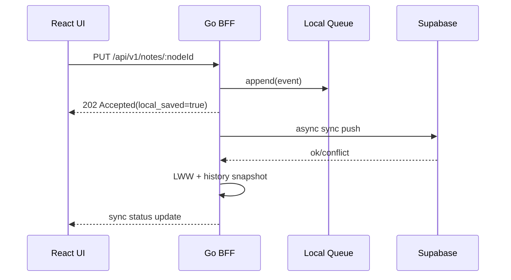
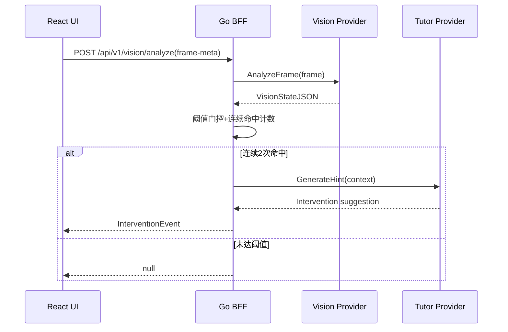
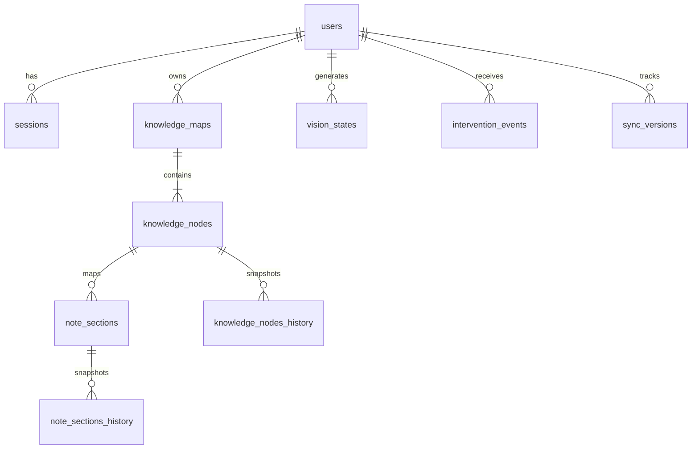

# Prism TDD 技术方案（架构评审版，MVP）

## 1. 文档信息与范围
| 项 | 内容 |
| --- | --- |
| 文档版本 | v1.2 |
| 最后更新 | 2026-03-04 |
| 关联文档 | `docs/prd.md` |
| 适用对象 | 架构师、后端、前端、客户端、测试、运维 |
| 首发终端 | Tauri 桌面端（Windows/macOS） |
| UI 技术栈 | React + Shadcn UI + Tailwind v4 + CSS Variables + lucide-react + Framer Motion |
| 技术栈冻结版本 | stack-freeze-2026-03-04 |
| 技术栈冻结日期 | 2026-03-04 |

### 1.1 范围
1. 覆盖 PRD 的 FR-01 ~ FR-04 全量技术设计。
2. 覆盖端到端链路：UI -> 本地 BFF -> 模型 Provider -> Supabase。
3. 覆盖离线可写、回放同步、冲突处理、降级策略。
4. 覆盖 Shadcn 全量引入下的 UI 分层、治理和测试方案。

### 1.2 非范围
1. 不定义教师端、家长端、管理后台实现。
2. 不定义完整 CI/CD 流水线脚本实现细节。
3. 不定义模型供应商商务选型与采购策略。

### 1.3 技术栈冻结说明
1. 本文档冻结实现栈：`Zustand + TanStack Query`、`chi + pgx + sqlc + goose`、`Supabase PKCE + BFF 验 JWT`、`SQLite`、`OpenTelemetry + Prometheus/Grafana + Sentry`。
2. 包管理器默认 `bun`，Go 依赖注入默认手动 DI（不引入 wire/fx）。
3. 冻结后不做框架级替换，新增规范先修订 TDD，再进入代码实现。

## 2. 术语与缩写
| 术语 | 说明 |
| --- | --- |
| Tauri | 桌面壳层，承载 React 前端并管理系统权限 |
| Shadcn UI | 基于 Radix 与 Tailwind 的可组合组件集合 |
| BFF | Backend For Frontend，本地 Go 服务，监听 `127.0.0.1` |
| Provider | 模型适配抽象层，统一文本/视觉/助教能力 |
| FR | Functional Requirement，功能需求 |
| NFR | Non-Functional Requirement，非功能需求 |
| LWW | Last Write Wins，最后写入生效冲突策略 |
| RLS | Row Level Security，Supabase 行级权限控制 |
| UAT | User Acceptance Test，用户验收测试 |
| SSE | Server-Sent Events，服务端推送流式文本 |

## 3. 技术目标与非目标
### 3.1 技术目标
1. 构建可替换模型供应商的统一编排层。
2. 在网络波动下保证本地可写与后续可同步。
3. 保证监测链路隐私最小化，图像零持久化。
4. 提供可评审接口契约与可观测性基线。
5. 建立可复用、可治理、可测试的 Shadcn 前端体系。

### 3.2 技术非目标
1. 不实现端侧离线大模型推理。
2. 不实现多用户实时协同编辑。
3. 不实现跨组织多租户隔离（MVP 单租户逻辑隔离）。

## 4. 总体架构与部署拓扑
### 4.1 逻辑架构
1. 客户端层：Tauri Shell + React UI（Shadcn + Tailwind v4），处理界面、交互、设备权限。
2. 前端状态层：`Zustand + TanStack Query`，负责本地状态、服务端状态缓存、失效策略。
3. 本地服务层：Go `chi` BFF，处理鉴权、编排、降级、同步队列。
4. 云数据层：Supabase（Postgres + Storage + Auth + Realtime）。
5. 模型层：Provider 抽象，支持 OpenAI 兼容接口或其他供应商。
6. 可观测层：`OpenTelemetry + Prometheus/Grafana + Sentry`。

### 4.2 部署拓扑（MVP）
```mermaid
flowchart LR
  A[Tauri Shell] --> B[React UI (Shadcn + Tailwind v4)]
  B --> S[State Layer: Zustand + TanStack Query]
  S --> C[Local Go BFF:127.0.0.1]
  C --> D[Provider Router]
  D --> E[Text/Vision/Tutor Providers]
  C --> F[Supabase Postgres]
  C --> G[Supabase Storage]
  C --> H[Supabase Auth]
  C --> I[Supabase Realtime]
  B --> J[OS Camera Permission]
  B --> K[Sentry FE]
  C --> L[OpenTelemetry Collector]
  L --> M[Prometheus]
  M --> N[Grafana]
  C --> O[Sentry BE]
```

### 4.3 前端 UI 分层定稿
1. `Page Layout`：Focus Space 页面布局与区域编排。
2. `Prism Business Components`：业务组件（导图区、笔记区、Orb、监测面板）。
3. `Shadcn Base Components`：通用交互组件（Button、Dialog、Tabs 等）。
4. `Tailwind v4 + CSS Variables`：设计令牌、主题与样式原子层。

### 4.4 核心设计原则
1. 前端不直接访问模型供应商，统一经本地 BFF。
2. 业务写操作先落本地队列，后异步回放至云端。
3. 全链路采用请求 ID，便于追踪与审计。
4. Shadcn 只承载通用交互，业务逻辑仅在 `Prism*` 封装组件实现。
5. 图标统一 `lucide-react`，动效统一由 Framer Motion 管理。

## 5. 运行时组件职责划分
### 5.1 React UI（运行时）
1. 展示 Focus Space、导图、笔记板、Prism Orb。
2. 发起 BFF API 请求并处理 SSE 流式输出。
3. 发起权限请求并展示隐私说明状态。
4. 维护页面级状态机与组件级故障回退 UI。

### 5.2 UI Foundation Layer（Shadcn 基础组件层）
1. 提供通用输入、弹层、反馈、导航、命令面板组件。
2. 通过 `class-variance-authority` 与 CSS Variables 承载样式策略。
3. 不包含任何业务数据请求与规则计算逻辑。

### 5.3 Prism Business Components（业务组件层）
1. `PrismExplorePanel`：探索输入、附件入口、提交状态管理。
2. `PrismKnowledgeCanvas`：导图容器、节点交互、高亮联动。
3. `PrismNotesPanel`：节点讲解展示、流式渲染、编辑保存。
4. `PrismOrbAssistant`：主动/被动助学交互与动效状态。
5. `PrismVisionGuard`：授权状态、监测开关、健康提示。

### 5.4 State Layer（Zustand + TanStack Query）
1. Zustand 负责本地状态：UI 展示状态、临时草稿、离线同步标记。
2. TanStack Query 负责服务端状态：请求缓存、失效重拉、后台刷新。
3. 边界约束：业务组件不得直接发请求，统一通过 Query hooks 或 action 层。
4. Query key 规范绑定 `RequestMeta`，用于缓存一致性和埋点关联。

### 5.5 Tauri Shell
1. 管理桌面窗口与系统集成能力。
2. 协助摄像头权限桥接与本地安全配置。
3. 启动时拉起/守护本地 Go BFF 进程。

### 5.6 Go BFF（chi + pgx + sqlc + goose）
1. API 网关与业务编排。
2. 输入归一化、结构修复、错误码统一。
3. 离线队列落盘（SQLite）、回放同步与冲突处理。
4. Provider 路由、超时与重试控制。
5. JWT 校验、审计日志与指标上报。

### 5.7 Provider Router
1. 统一定义 `TextProvider`、`VisionProvider`、`TutorProvider` 接口。
2. 维护供应商配置、权重与熔断策略。
3. 返回统一领域对象，屏蔽供应商差异。

### 5.8 Supabase
1. Auth：PKCE 登录与会话管理。
2. Postgres：核心业务表与历史快照。
3. Storage：非图像业务附件（如学习资料）。
4. Realtime：同步状态与变更通知。

## 6. 数据流与关键时序
### 6.1 文本探索链路（FR-01）


### 6.2 离线写入与同步链路


### 6.3 主动干预链路（FR-04）


## 7. 模块设计（FR-01 ~ FR-04）
### 7.1 FR-01 探索引擎（文本/图片）
1. 输入：文本或图片元数据（图片二进制仅瞬时传输）。
2. 输出：`KnowledgeOutlineJSON`。
3. 关键实现：
4. `InputNormalizer`：统一输入结构。
5. `OutlineRepairer`：修复层级、边关系、空节点。
6. `OutlineValidator`：校验字段完整性与节点最小数量。
7. 前端抽象约束：采用统一请求状态机与错误通道，不在 TDD 锁定具体组件与文案实现。

### 7.2 FR-02 笔记联动与流式讲解
1. 输入：`node_id`、编辑内容、讲解请求。
2. 输出：`NoteSection`、SSE 流式内容。
3. 关键实现：
4. `NodeNoteIndex`：`node_id -> note_section` 快速映射。
5. `SSEStream`：分块返回讲解，支持断点继续。
6. `ContentOriginTag`：`generated_by(ai|user)` 标注。
7. 前端抽象约束：流式渲染必须支持断线恢复、局部失败不清空已生成内容。

### 7.3 FR-03 多模态状态监测
1. 输入：授权状态、抽帧元数据。
2. 输出：`VisionStateJSON`（仅标签）。
3. 关键实现：
4. `VisionScheduler`：默认 15 秒调度周期。
5. `ConfidenceGate`：低置信度不触发干预，仅记录事件。
6. `ConsentGuard`：未授权即拒绝采集，返回 `E_PRIVACY_CONSENT_REQUIRED`。
7. 前端抽象约束：授权状态、监测状态、错误状态必须可区分且可恢复。

### 7.4 FR-04 Prism Orb 主动干预
1. 输入：`VisionStateJSON`、用户上下文、节点进度。
2. 输出：`InterventionEvent` 或 `null`。
3. 关键实现：
4. `InterventionRuleEngine`：连续命中阈值判定。
5. `CooldownWindow`：防抖，避免高频打断。
6. `ActionPlanner`：生成简化讲解/前置复习/变式题动作。
7. 前端抽象约束：采用 `OrbVisualState` 状态机表达交互阶段，不在 TDD 固定动效参数与文案。

### 7.5 前端表现约束（架构级）
1. 统一状态机：最少覆盖 `idle/loading/success/error/degraded`。
2. 统一错误通道：模块内错误优先局部提示，全局故障走统一反馈通道。
3. 主题机制：采用 CSS Variables token 化与主题注入，不在 TDD 固定视觉参数。

## 8. 接口契约（本地 BFF、云端、模型 Provider）
### 8.1 本地 BFF API 草案（业务语义无变更）
1. 本节只保留契约要点，完整 OpenAPI 以 `docs/openapi.yaml` 为唯一事实源。
```yaml
openapi: 3.1.0
info:
  title: Prism Local BFF API
  version: 1.0.0
servers:
  - url: http://127.0.0.1:{port}
paths:
  /api/v1/explore/text:
    post:
      summary: 文本探索
  /api/v1/explore/image:
    post:
      summary: 图片探索
  /api/v1/notes/{nodeId}:
    get:
      summary: 获取节点笔记
    put:
      summary: 保存节点笔记
  /api/v1/notes/{nodeId}/stream:
    get:
      summary: 流式生成节点讲解(SSE)
  /api/v1/vision/analyze:
    post:
      summary: 学习状态标签化分析
  /api/v1/intervention/evaluate:
    post:
      summary: 干预判定
  /api/v1/sync/push:
    post:
      summary: 推送离线队列
  /api/v1/sync/pull:
    post:
      summary: 拉取增量数据
```

### 8.1.1 响应契约基线
1. 成功响应统一：`{ "request_id": "...", "data": {...}, "meta": {...可选} }`。
2. 失败响应统一：`{ "request_id": "...", "error": { "code": "...", "message": "...", "retryable": true|false, "details": {...可选} } }`。
3. `error.code` 必须来自 `8.4 错误码体系`。
4. 受保护接口的成功/失败响应都必须回传 `request_id`。

### 8.1.2 SSE Contract（续传与幂等）
1. SSE 事件必须携带 `id`，并在单流内单调递增。
2. 断线重连统一使用 `Last-Event-ID`（不使用 `resume_token` 变体）。
3. 服务端基于 `Last-Event-ID` 补发未消费事件（有限窗口，默认最近 5 分钟或 500 条）。
4. SSE 传输语义为 at-least-once，客户端必须按 `event.id` 去重。
5. 标准事件：结束事件 `event: done`，心跳事件 `event: heartbeat`。

### 8.2 领域对象（沿用 PRD）
1. `KnowledgeOutlineJSON`
2. `VisionStateJSON`
3. `InterventionEvent`
4. `NoteSection`
5. `ConsentState`

### 8.3 Provider 抽象接口
```go
type TextProvider interface {
    GenerateOutline(ctx context.Context, input TextExploreInput) (KnowledgeOutline, error)
}

type VisionProvider interface {
    AnalyzeFrame(ctx context.Context, input VisionFrameInput) (VisionState, error)
}

type TutorProvider interface {
    GenerateHint(ctx context.Context, input TutorHintInput) (InterventionSuggestion, error)
}
```

### 8.4 错误码体系
| 错误码 | 场景 | HTTP 建议 | 处理策略 |
| --- | --- | --- | --- |
| `E_TIMEOUT` | Provider/BFF 超时 | 504 | 前端提示重试，后台指数退避 |
| `E_PROVIDER_UNAVAILABLE` | 模型不可用 | 503 | 熔断并切备选 Provider |
| `E_PRIVACY_CONSENT_REQUIRED` | 未授权采集 | 403 | 触发授权引导，不重试 |
| `E_SYNC_CONFLICT` | 同步冲突 | 409 | LWW 生效并写入快照 |
| `E_RATE_LIMITED` | 频率超限 | 429 | 前端限流提示，后台延后重试 |
| `TOKEN_EXPIRED` | 访问令牌过期 | 401 | 前端触发 refresh，失败则跳转登录 |
| `TOKEN_INVALID` | 访问令牌无效 | 401 | 清理本地会话并跳转登录 |
| `RLS_DENIED` | RLS 拒绝访问 | 403 | 前端提示权限不足并上报审计 |

### 8.5 鉴权约定（Supabase PKCE + BFF 验 JWT）
1. 受保护接口必须携带 `Authorization: Bearer <access_token>`。
2. 前端使用 Supabase PKCE 完成登录，拿到 `access_token/refresh_token` 后写入安全存储。
3. BFF 仅信任通过签名和时效验证的 JWT，并校验 `sub` 与请求上下文 `user_id` 一致。
4. 返回 `401 TOKEN_EXPIRED` 时，前端执行一次 refresh 并重放原请求。
5. refresh 失败或返回 `401 TOKEN_INVALID` 时，前端清空会话并跳转登录。
6. 返回 `403 RLS_DENIED` 时，不重试，直接提示权限不足。

### 8.6 前端状态与 UI 契约类型
```ts
type UIThemeTokens = {
  colorBg: string;
  colorFg: string;
  colorPrimary: string;
  radiusSm: string;
  radiusMd: string;
  shadowMd: string;
  spaceMd: string;
  fontSans: string;
};

type OrbVisualState = "idle" | "active" | "intervene" | "cooldown";

type KnowledgeNodeViewModel = {
  id: string;
  title: string;
  isSelected: boolean;
  isHighlighted: boolean;
  isLoading: boolean;
  error?: string;
};

type InterventionBannerState = {
  visible: boolean;
  priority: "low" | "medium" | "high";
  message: string;
  actionType: "explain_simpler" | "review_prerequisite" | "generate_variant";
};

type AuthSessionState = {
  userId: string | null;
  accessToken: string | null;
  refreshToken: string | null;
  expiresAt: number | null;
  isAuthenticated: boolean;
};

type SyncQueueState = {
  pendingCount: number;
  inFlight: boolean;
  lastSyncAt: number | null;
  lastErrorCode?: string;
};

type RequestMeta = {
  requestId: string;
  queryKey: string[];
  source: "ui" | "background_sync";
  startedAt: number;
};

type OfflineQueueEvent = {
  event_id: string;
  entity_type: "note_section" | "knowledge_node" | "session_meta";
  entity_id: string;
  op_type: "insert" | "update" | "delete";
  payload: Record<string, unknown>;
  version: number;
  idempotency_key: string;
  created_at: string;
};

type ApiSuccessEnvelope<T> = {
  request_id: string;
  data: T;
  meta?: Record<string, unknown>;
};

type ApiErrorEnvelope = {
  request_id: string;
  error: {
    code: string;
    message: string;
    retryable: boolean;
    details?: Record<string, unknown>;
  };
};
```

### 8.7 前端事件契约
1. `onExploreSubmit(payload: { text?: string; imageFile?: File })`
2. `onNodeSelect(nodeId: string)`
3. `onConsentToggle(enabled: boolean)`
4. `onInterventionAccept(eventId: string)`
5. `onInterventionReject(eventId: string)`

## 9. 数据模型与存储策略
### 9.1 Supabase 核心表
1. `users`
2. `sessions`
3. `knowledge_maps`
4. `knowledge_nodes`
5. `note_sections`
6. `vision_states`
7. `intervention_events`
8. `sync_versions`
9. `note_sections_history`
10. `knowledge_nodes_history`

### 9.2 本地存储
1. `offline_queue`：SQLite 队列表，离线写操作事件（`OfflineQueueEvent`）。
2. `local_cache`：最近导图与笔记读缓存。
3. `consent_state`：授权状态与隐私版本。

### 9.3 SQLite 队列表结构（本地）
1. 表名：`offline_queue`。
2. 主键：`event_id TEXT PRIMARY KEY`。
3. 核心字段：`entity_type`、`entity_id`、`op_type`、`payload_json`、`version`、`idempotency_key`、`status`、`retry_count`、`created_at`、`updated_at`。
4. 索引：`idx_offline_queue_status_created_at(status, created_at)`、`idx_offline_queue_idempotency_key(idempotency_key)`。
5. 约束：`idempotency_key` 全局唯一，避免重复回放。

### 9.4 关键字段约束
1. 可同步实体统一字段：`updated_at`、`version`、`source_device_id`。
2. `vision_states` 禁止存储原始图片 URL 或二进制。
3. 历史表保存冲突前版本快照和合并元数据。

### 9.5 ER 草案


## 10. 离线队列与同步机制
### 10.1 队列模型
1. 事件结构：`event_id`、`entity_type`、`entity_id`、`op_type`、`payload`、`version`、`idempotency_key`、`created_at`。
2. 入队时机：所有写操作先入队并本地确认。
3. 出队条件：网络可用、账号有效、未触发全局熔断。
4. 入队与本地业务写操作使用同一 SQLite 事务提交，避免“写成功但未入队”。

### 10.2 同步策略
1. Push：按事件顺序批量提交，成功后标记已同步。
2. Pull：按 `updated_at` 增量拉取远端变更。
3. 冲突：服务端执行 LWW，并将被覆盖版本写入历史表。
4. 回放事务：单批次失败时整批回滚，按事件粒度重试并记录 `retry_count`。

### 10.3 冲突处理规则
1. 比较优先级：`version` > `updated_at` > `source_device_id`。
2. 发生冲突返回 `E_SYNC_CONFLICT` 与 `conflict_snapshot_id`。
3. 前端默认展示“已自动合并”，支持查看历史版本。
4. 同步请求必须透传 `idempotency_key`，BFF 保证重复请求幂等。

## 11. 错误处理、重试与降级
### 11.1 重试
1. 幂等写接口使用 `idempotency_key`。
2. Provider 请求采用指数退避（`200ms`, `500ms`, `1s`，最多 3 次）。
3. 同步失败进入后台队列，前台不阻塞编辑。
4. TanStack Query 默认 `retry=2`，`retryDelay` 指数退避（`300ms`, `800ms`）。
5. `401 TOKEN_EXPIRED` 仅允许一次 refresh + 重放；`401 TOKEN_INVALID` 不重试。

### 11.2 降级矩阵
| 依赖故障 | 降级行为 |
| --- | --- |
| Text Provider 不可用 | 显示线性输入建议，支持稍后重试 |
| Vision Provider 不可用 | 关闭主动干预，仅保留手动助教 |
| Supabase 暂不可用 | 本地可写，延后同步 |
| Realtime 不可用 | 改为轮询同步状态 |

### 11.3 失败可见性
1. 用户侧提示分级：轻提示（重试）/中提示（降级）/强提示（需授权或登录）。
2. 日志侧保留 `request_id`、错误码、耗时、重试次数。
3. 前端统一通过 `Toast/Alert/Dialog` 三层反馈通道展示故障状态。
4. BFF 幂等键冲突命中时记录 `idempotency_hit=true` 到审计日志。

## 12. 安全、隐私与合规实现
### 12.1 权限与授权
1. 摄像头默认关闭，显式授权后方可采集。
2. 隐私条款版本化，`privacy_ack_version` 变化触发重签。
3. 用户撤销权限后一周期内停止采集。

### 12.2 数据最小化
1. 监测链路仅输出标签，不存图像实体。
2. 日志脱敏：不记录可识别个人信息的原始内容。
3. BFF 不透传供应商原始响应中的敏感字段。

### 12.3 Supabase 安全策略
1. 全表启用 RLS，按 `user_id` 隔离。
2. 角色密钥分层：客户端匿名最小权限、BFF 服务角色受限。
3. 审计表记录管理操作与关键安全事件。

## 13. 可观测性与运维
### 13.1 指标
1. API：P50/P95 延迟、成功率、错误率。
2. Provider：超时率、熔断次数、切换次数。
3. Sync：队列积压数、同步失败率、冲突率。
4. 助学：干预触发率、接受率、误触发率。
5. 前端 UI：组件渲染耗时（P95）、交互失败率、流式渲染掉帧率。
6. Prometheus 指标名：`prism_api_latency_ms`、`prism_api_errors_total`、`prism_sync_queue_depth`、`prism_sync_conflicts_total`、`prism_intervention_trigger_total`。

### 13.2 日志与追踪
1. 统一 `request_id` + `session_id` + `device_id_hash`。
2. 前端、BFF、Provider 调用统一链路追踪。
3. 前端事件埋点覆盖 `onExploreSubmit`、`onNodeSelect`、`onConsentToggle`、`onInterventionAccept/Reject`。
4. 日志保留周期按最短必要原则配置。
5. OpenTelemetry trace 属性至少包含：`request_id`、`user_id_hash`、`route`、`provider_name`、`error_code`、`retry_count`。
6. Sentry 上报范围：前端未捕获异常、BFF 5xx、同步回放异常、鉴权异常链路。

### 13.3 告警
1. Provider 超时率连续 5 分钟超阈值触发告警。
2. 队列积压超阈值触发同步告警。
3. 干预误触发率异常升高触发策略回滚告警。
4. 前端流式掉帧率超阈值触发渲染性能告警。

## 14. 测试策略与验收映射
### 14.1 测试分层
1. 前端单元/组件测试：`Vitest + Testing Library`，覆盖状态切换、组件禁用/加载/错误态。
2. 前端 E2E 与视觉回归：`Playwright`，覆盖主链路、快照对比、无障碍基础校验。
3. 后端单元/集成：`Go test + testify`，覆盖规则引擎、鉴权、同步回放、幂等与冲突。
4. 契约测试：OpenAPI 与前端调用一致性，Provider 适配一致性。
5. 性能测试：首屏渲染、节点切换响应、流式刷新抖动率满足 NFR。
6. 隐私测试：零图像落盘、授权撤销即时停采。

### 14.2 新增关键场景（技术栈冻结后）
1. 鉴权链路：PKCE 登录成功、token 过期刷新、无效 token 拒绝访问。
2. 状态层：Zustand 本地状态切换与 TanStack Query 缓存失效行为。
3. 队列一致性：SQLite 入队、断网回放、幂等重放、冲突回退。
4. 可观测：OTel trace 连通、Prom 指标暴露、Sentry 捕获前后端异常。
5. E2E：登录后探索-笔记-同步-干预全链路与权限撤销路径。
6. Envelope 一致性：2xx/4xx/5xx 响应都包含 `request_id` 且结构符合 `ApiSuccessEnvelope/ApiErrorEnvelope`。
7. 错误码闭环：`error.code` 必须命中 `8.4` 白名单。
8. SSE 断线恢复：携带 `Last-Event-ID` 重连后可续传且无丢失。
9. SSE 幂等：重复下发同一 `event.id` 时客户端状态不重复变更。

### 14.3 与 PRD UAT 映射
| PRD UAT | TDD 测试项 |
| --- | --- |
| UAT-01 文本探索 | 集成测试 `explore_text_e2e` + 组件测试 `explore_submit_states` |
| UAT-02 图片探索 | 集成测试 `explore_image_e2e` |
| UAT-03 导图联动 | 前端联调测试 `node_note_linking` + 视觉回归 `focus_graph_linking_snapshot` |
| UAT-04 流式讲解 | SSE 测试 `note_stream_resume` + 性能测试 `stream_frame_drop_rate` |
| UAT-05 状态监测授权 | 权限+调度测试 `vision_authorized_schedule` |
| UAT-06 状态监测降级 | 降级测试 `vision_denied_fallback` |
| UAT-07 主动干预触发 | 规则测试 `intervention_two_hits_trigger` |
| UAT-08 主动干预阈值 | 规则测试 `intervention_single_hit_no_trigger` |
| UAT-09 隐私约束 | 隐私测试 `no_image_persistence` + 合规测试 `consent_version_reack` |
| UAT-10 失效场景 | 异常测试 `provider_timeout_degrade` + UI 测试 `error_channel_rendering` |

## 15. 风险、权衡与后续演进
### 15.1 关键风险
1. 供应商输出波动导致结构不稳定。
2. Supabase 网络波动导致同步延迟。
3. 视觉识别误差导致干预体验波动。
4. Shadcn 全量引入带来组件治理和体积膨胀风险。

### 15.2 当前权衡
1. 采用 LWW 以降低 MVP 冲突处理复杂度。
2. 采用本地回环 BFF 以换取治理能力与可观测性。
3. 采用 Provider 抽象以换取长期可替换性。
4. 采用 Shadcn 全量引入，但要求业务只通过 `Prism*` 封装层调用。

### 15.3 Shadcn 风险控制
1. 组件治理：维护 `docs/ui-components-manifest.md`，登记启用组件与用途。
2. 包体积控制：路由分包 + Tree Shaking + 对 `Command`/`Dialog` 组合动态加载。
3. 样式一致性：颜色、圆角、间距统一由 CSS Variables 提供，禁止业务页硬编码。
4. 二次封装：禁止业务直接散用原子组件，统一通过 `Prism*` 组件出口。

### 15.4 后续演进
1. 引入字段级合并策略替代纯 LWW。
2. 引入策略配置中心动态调参干预阈值。
3. 引入更细粒度模型质量评估与自动回归机制。

## 附录 A：请求与响应示例
### A.1 `POST /api/v1/explore/text`
```json
{
  "topic": "相对论基础",
  "grade_hint": "high_school",
  "language": "zh-CN"
}
```

```json
{
  "request_id": "req_01JX...",
  "data": {
    "topic": "相对论基础",
    "difficulty": "beginner",
    "source_type": "text",
    "nodes": [
      { "id": "n1", "title": "时空观", "summary": "..." }
    ],
    "edges": [
      { "source": "n1", "target": "n2", "relation": "contains" }
    ]
  }
}
```

### A.2 `POST /api/v1/intervention/evaluate`
```json
{
  "session_id": "sess_123",
  "vision_state": {
    "focus_level": "low",
    "emotion": "frustrated",
    "posture": "too_close",
    "confidence": 0.84
  }
}
```

```json
{
  "request_id": "req_01JX...",
  "data": {
    "trigger_reason": "mixed",
    "trigger_count": 2,
    "message": "检测到你可能遇到了困难，需要我拆解成更简单的步骤吗？",
    "action_type": "explain_simpler",
    "accepted": null
  }
}
```

## 附录 B：评审清单
### B.1 架构评审项
1. 本地 BFF 边界是否覆盖所有模型调用与同步逻辑。
2. Provider 抽象是否满足可替换、可熔断、可观测。
3. 离线队列是否保证幂等与最终一致性。
4. Shadcn 分层边界是否清晰且可执行。

### B.2 接口评审项
1. OpenAPI 是否覆盖核心读写路径与错误码。
2. SSE 流式协议是否定义断线恢复语义。
3. 接口是否满足前端状态管理需要的最小字段集。
4. 前端 UI 契约类型是否满足组件解耦和测试隔离。

### B.3 隐私合规评审项
1. 授权状态流转是否闭环。
2. 监测链路是否确保原始图像零落盘。
3. RLS 与日志脱敏策略是否可审计。

### B.4 发布前检查项
1. UAT 10 项是否全部通过。
2. 告警阈值与降级开关是否可运行验证。
3. 回滚路径是否完成演练。
4. `docs/ui-components-manifest.md` 是否与实际组件使用一致。

## 附录 C：Design Token 约束（架构级）
1. 采用 CSS Variables token 化，配合主题注入机制，不在 TDD 固定具体色值/阴影/圆角参数。
2. Token 分类至少覆盖：颜色、字号/字重、间距、圆角、阴影、动效时长。
3. 业务组件禁止硬编码视觉参数，必须通过 token 消费。
4. 具体 token 值与命名规范沉淀到 Design System 文档，不在本 TDD 维护。

## 附录 D：Shadcn 治理策略摘要
1. 组件清单以 `docs/ui-components-manifest.md` 为唯一事实来源。
2. TDD 仅约束治理原则，不维护逐组件映射表。
3. 业务代码仅通过 `Prism*` 封装层使用 UI 组件，禁止散用原子组件。
4. 高成本组件按需加载，组件变更必须同步更新 manifest。

## 附录 E：技术栈冻结清单与默认规范
### E.1 冻结清单
1. UI 与前端：`React + Shadcn UI + Tailwind v4 + CSS Variables + lucide-react + Framer Motion`
2. 前端状态与请求：`Zustand + TanStack Query`
3. Go 后端：`chi + pgx + sqlc + goose`
4. 鉴权：`Supabase PKCE + BFF 验证 JWT`
5. 本地离线队列：`SQLite`
6. 测试：`Vitest + Testing Library + Playwright + Go test/testify`
7. 可观测：`OpenTelemetry + Prometheus/Grafana + Sentry`

### E.2 默认规范
1. 包管理器默认：`bun`。
2. Go 依赖注入默认：手动 DI（不引入 wire/fx）。
3. 业务 API 路径与语义不变，仅扩展认证与观测约定。
4. 新增规范必须先更新 TDD，再进入实现。
5. MVP 不引入额外重型基础设施（如消息队列）。

